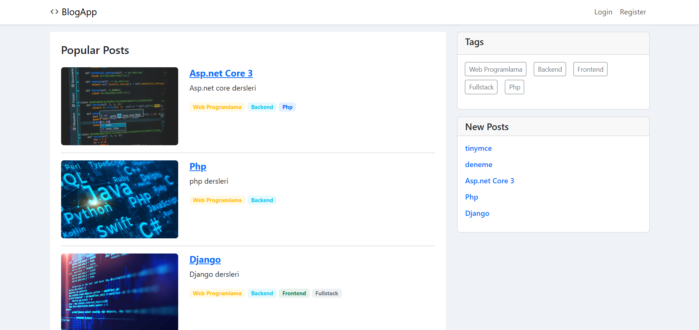
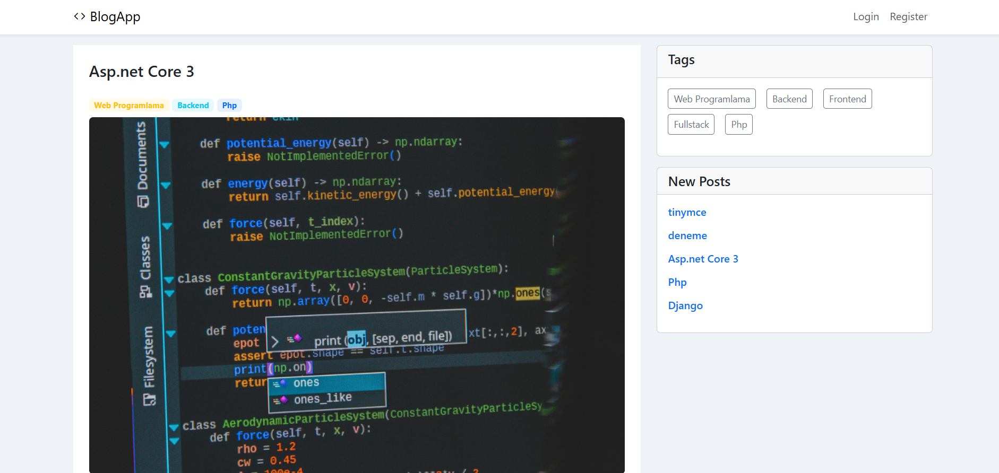
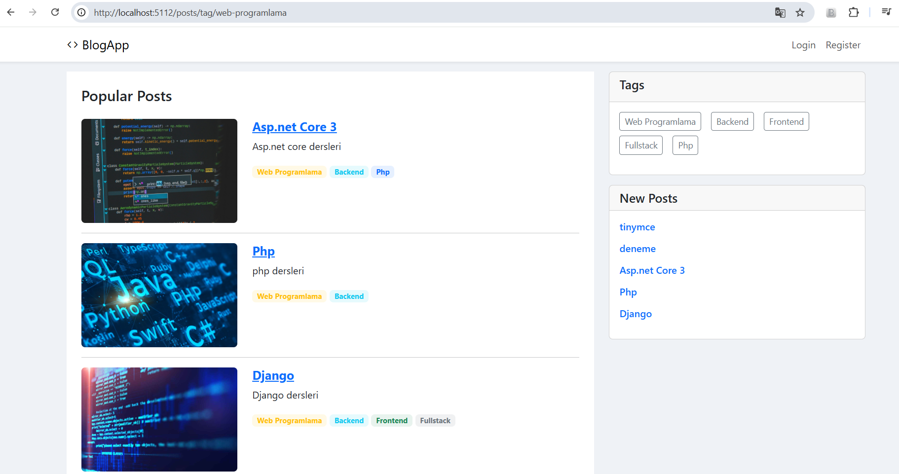
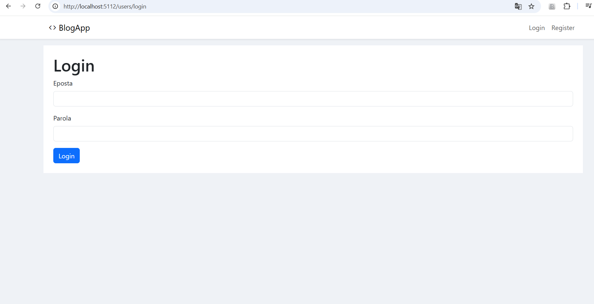
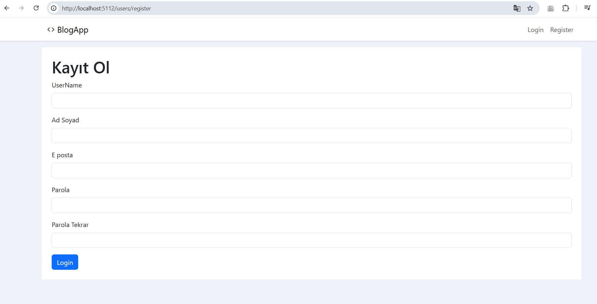
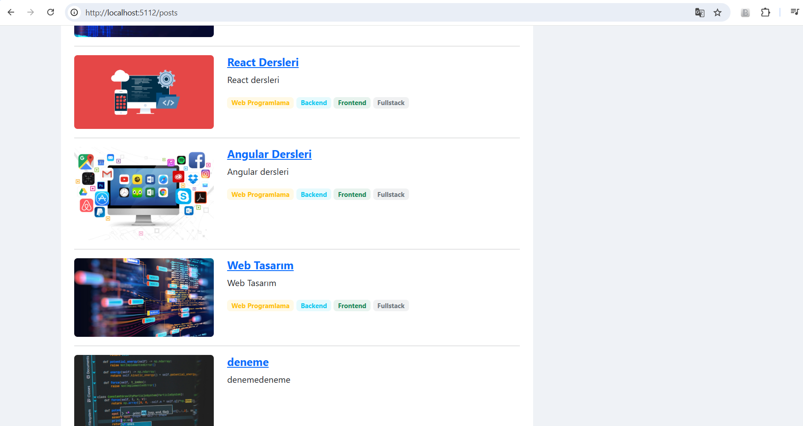

# 📝 BlogApp - Dinamik Blog Platformu (.NET Core MVC)

Bu proje, **ASP.NET Core MVC** mimarisi kullanılarak geliştirilmiş, kullanıcıların kayıt olup kendi blog yazılarını paylaşabildiği, içerikleri yönetebildiği ve diğer yazıları görüntüleyebildiği tam kapsamlı bir web uygulamasıdır.

## 📋 Proje Hakkında

BlogApp, modern web geliştirme standartlarına uygun olarak tasarlanmış bir İçerik Yönetim Sistemi (CMS) prototipidir. Proje, sadece veri göstermekle kalmayıp, **Kullanıcı (User)** ve **Gönderi (Post)** arasındaki ilişkisel yapıyı (Relational Data) yöneten bir backend mimarisine sahiptir.

### 🚀 Temel Özellikler

Proje modüler bir yapıda olup, temel olarak iki ana kontrolcü üzerinden işler:

* **📝 İçerik Yönetimi (`PostsController`):**
    * **CRUD İşlemleri:** Yeni blog yazısı oluşturma, düzenleme ve silme.
    * **Detay Sayfası:** Yazıların başlık, içerik, tarih ve görsel detaylarının görüntülenmesi.
    * **Listeleme:** Tüm güncel yazıların ana sayfada akış olarak sunulması.
    * **Url Yönetimi:** (Eğer yapıldıysa) SEO dostu URL yapısı (Slug).

* **👤 Kullanıcı Yönetimi (`UsersController`):**
    * **Kimlik Doğrulama:** Kullanıcı kayıt (Register) ve giriş (Login) işlemleri.
    * **Profil Yönetimi:** Kullanıcıların kendi bilgilerini güncelleyebilmesi.
    * **Yazar İlişkisi:** Hangi yazının hangi kullanıcı tarafından yazıldığının takibi.

## 🛠️ Teknolojiler ve Mimari

Bu proje aşağıdaki teknoloji yığını ile geliştirilmiştir:

* **Framework:** ASP.NET Core 6.0 / 7.0+ (MVC)
* **Dil:** C#
* **Veritabanı:** MySql
* **ORM:** Entity Framework Core (Code First)
* **Frontend:** Razor Views (.cshtml), Bootstrap 5, HTML5/CSS3
* **Mimari:** Model-View-Controller (MVC)

## 🏗️ Veritabanı İlişkileri

Proje, Entity Framework Core kullanılarak şu ilişkileri yönetir:
* **One-to-Many (Bire-Çok):** Bir **Kullanıcı (User)**, birden fazla **Yazı (Post)** yazabilir. Yazılar, yazarlarına (Users) bağlıdır.

